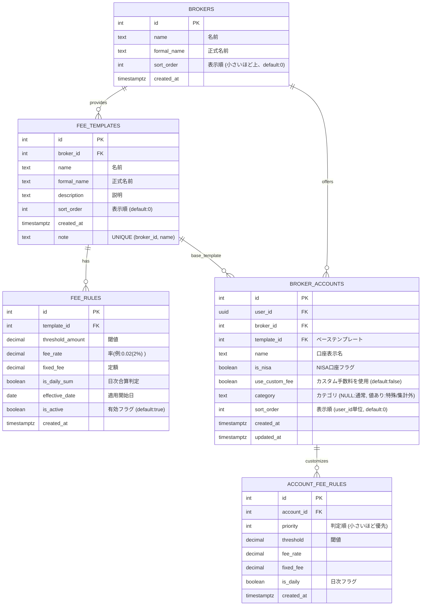

- [2. データベース・テーブル設計案](#2-データベーステーブル設計案)
  - [概要](#概要)
  - [設計時のルール](#設計時のルール)
  - [手数料管理の柔軟性](#手数料管理の柔軟性)
  - [修正・追加後のデータベース設計案](#修正追加後のデータベース設計案)
    - [① `brokers` (証券会社マスタ)](#-brokers-証券会社マスタ)
    - [② `fee_templates` (手数料パターン定義)](#-fee_templates-手数料パターン定義)
    - [③ `fee_rules` (手数料計算ルール詳細)](#-fee_rules-手数料計算ルール詳細)
    - [① `broker_accounts` (証券口座)](#-broker_accounts-証券口座)
    - [② `account_fee_rules` (個別口座専用ルール)](#-account_fee_rules-個別口座専用ルール)
    - [③ `observation_logs` (トレード観察ログ)](#-observation_logs-トレード観察ログ)
  - [DDL](#ddl)


## 2. データベース・テーブル設計案

「一元管理」を実現するために必要となる、リレーショナルデータベース（PostgreSQL / Supabaseなど）を想定したテーブル構成です。

### 概要

本システムでは、ユーザーごとに異なる「証券会社」「口座区分（NISA等）」「手数料体系」を柔軟に管理できる構造を採用します。特に複雑な証券会社の手数料体系を正確にシミュレーションするため、「標準マスタ」と「個別スナップショット」を切り替えるハイブリッド方式で設計します。

### 設計時のルール
* システム更新の難易度を下げるため外部参照は行わないものとする。
* RLSは利用しないものとする。利用する際の留意点が複雑のため
* 権限の付与として、authenticated anonに対して、権限の付与が必要（select update insert delete）

### 手数料管理の柔軟性

* **多対多の口座紐付け**: 1人のユーザーに対して複数の証券口座（松井、野村等）を紐付け可能。
* **標準パターンの適用**: 証券会社ごとに複数の手数料パターン（パターン1、プランA等）をマスタとして定義し、ユーザーは口座ごとに最適なものを選択。
* **個別カスタマイズの独立性**: 標準パターンから条件を変更・追加する場合、その口座専用の独立したルールデータ（`account_fee_rules`）を生成します。これにより、マスタの改定に左右されない確実な計算と、柔軟な個別調整を両立させます。
* **マスタ改定への対応**: 手数料改定時には `fee_rules` に新しい有効ルールを追加します。個別カスタマイズを行っていないユーザーには常に最新のアクティブなマスタールールが適用され、カスタマイズ済みの口座は独立性が担保されます。

---

### 修正・追加後のデータベース設計案

ユーザーごとに証券会社と手数料パターンを紐づけつつ、さらに「個別調整」を可能にするために、以下の構成が妥当です。

#### ① `brokers` (証券会社マスタ)


証券会社そのものを管理します。

* `id`: int (PK)
* `name`: string (略称：松井、野村など)
* `formal_name`: string (正式名称：松井証券株式会社など)
* `sort_order`: int (表示順序)


#### ② `fee_templates` (手数料パターン定義)

証券会社が提供する標準的な手数料コース（プラン）を定義します。

* `id`: int (PK)
* `broker_id`: int (Brokers参照)
* `name`: string (略称：パターン1、一日定額など)
* `formal_name`: string (正式名称：ボックスレートコースなど)
* `description`: text (プランの説明)
* `sort_order`: int (表示順序)

#### ③ `fee_rules` (手数料計算ルール詳細)

「100万までは2%」といった具体的な条件を保持します。1つのテンプレートに複数のルールが紐づきます。

* `id`: int (PK)
* `template_id`: int (FK to fee_templates)
* `threshold_amount`: decimal (閾値：100万、50万など)
* `fee_rate`: decimal (手数料率：2%なら 0.02)
* `fixed_fee`: decimal (定額の場合の金額)
* `is_daily_sum`: boolean (1日の合計額に対して適用するかどうか)
* `effective_date`: date (適用開始日)
* `is_active`: boolean (現在有効なルールかどうかのフラグ)


#### ① `broker_accounts` (証券口座)

ここが要件の核となります。

* `id`: int (PK)
* `user_id`: UUID (FK)
* `broker_id`: int (FK: 松井、野村など)
* `name`: text (口座の表示名。ユーザーが自由に設定。例：「メイン口座」「NISA用」)
* `template_id`: int (FK: ベースとなるパターン。カスタマイズ後も「元は何だったか」の参照として保持)
* `is_nisa`: boolean
* **`use_custom_fee`**: boolean (初期値: `false`)
* `category`: text (カテゴリ。NULL: 未指定(通常)、値あり: 特殊口座として集計対象外)
* `sort_order`: int (表示順。ユーザーごとに設定。小さいほど上)

#### ② `account_fee_rules` (個別口座専用ルール)

* `id`: int (PK)
* `account_id`: int (FK to `broker_accounts`)
* `priority`: int (判定順序)
* `threshold`: decimal (閾値: 100万など)
* `fee_rate`: decimal (率: 0.009 = 0.9%)
* `is_daily`: boolean (1日の合計額判定か)

#### ③ `observation_logs` (トレード観察ログ)

日々のトレードの振り返りや市場の観察記録を保存します。

* `id`: int (PK)
* `user_id`: UUID (FK)
* `date`: date (記録日)
* `content`: text (内容)
* `stocks`: text[] (関連銘柄コード配列)
* `tags`: text[] (タグ配列)
* `is_active`: boolean (有効フラグ)

---





### DDL

```sql
-- ==========================================
-- 1. マスタ系テーブル
-- ==========================================

-- ① 証券会社マスタ
CREATE TABLE brokers (
    id SERIAL PRIMARY KEY,
    name TEXT NOT NULL UNIQUE,         -- 略称（例: 松井、野村）
    formal_name TEXT,                  -- 正式名称（例: 松井証券株式会社）
    sort_order INTEGER DEFAULT 0,      -- 表示順（数値が小さいほど上に表示）
    created_at TIMESTAMPTZ DEFAULT NOW()
);

-- サンプルデータの更新
INSERT INTO brokers (name, formal_name, sort_order) VALUES 
('松井証券', '松井証券株式会社', 10),
('野村証券', '野村證券株式会社', 20),
('SBI証券', '株式会社SBI証券', 30),
('楽天証券', '楽天証券株式会社', 40);

-- ==========================================
-- マイグレーション: brokers にソフトデリート用カラムを追加する
-- 概要: 既存データベースに対して論理削除フラグ（is_active）を追加する例。
-- 実行場所: Supabase SQL Editor や psql などで実行してください。
-- 注意: 本番環境ではバックアップ・ステージング検証を必ず行ってください。
-- ==========================================

-- 追加 + 既存データの初期化 + インデックス（オプション）
BEGIN;
ALTER TABLE public.brokers ADD COLUMN IF NOT EXISTS is_active BOOLEAN DEFAULT TRUE;
ALTER TABLE public.brokers ALTER COLUMN is_active SET DEFAULT TRUE;
UPDATE public.brokers SET is_active = TRUE WHERE is_active IS NULL;
-- インデックス（is_active でフィルタするクエリが多い場合は追加を検討）
CREATE INDEX IF NOT EXISTS idx_brokers_is_active ON public.brokers (is_active);
COMMIT;

-- ロールバック（必要なら）
-- ALTER TABLE public.brokers DROP COLUMN IF EXISTS is_active;

-- 運用上の注意・チェックリスト:
-- 1) RLS（Row Level Security）ポリシーを利用している場合、is_active を考慮したポリシー更新が必要になることがあります。
-- 2) アプリ側の一覧取得クエリに is_active=true のフィルターを追加してください。例:
--    const { data: brokersRaw } = await supabase
--      .from("brokers")
--      .select("*")
--      .eq("is_active", true)
--      .order("sort_order", { ascending: true });
-- 3) 既存のフロントエンド/バックエンドで "非アクティブ" をどう取り扱うか（非表示・ラベル表示・検索対象外等）を決めること。

-- 追加で検討: 物理削除ではなく is_active=false を用いることで履歴保持ができ、誤削除時の復旧が容易になります。

-- ② 手数料パターン定義（テンプレート）
CREATE TABLE fee_templates (
    id SERIAL PRIMARY KEY,
    broker_id INTEGER,               -- 証券会社マスタ(brokers.id)への紐付け
    name TEXT NOT NULL,              -- 略称・識別名（例: パターン1）
    formal_name TEXT,                -- 正式名称（例: 一日定額手数料コース）
    description TEXT,                -- プランの説明
    sort_order INTEGER DEFAULT 0,    -- 表示順
    created_at TIMESTAMPTZ DEFAULT NOW()
);

-- サンプルデータの更新例
INSERT INTO fee_templates (broker_id, name, formal_name, description, sort_order) 
VALUES 
(1, '松井パターン1', '松井証券 ボックスレート', '1日の約定代金合計で決まるコース', 10),
(2, '野村パターン1', '野村證券 本店限定プラン', '店舗窓口での取引向けプラン', 10);

-- ③ 手数料計算ルール詳細（マスタ）
CREATE TABLE fee_rules (
    id SERIAL PRIMARY KEY,
    template_id INTEGER, -- 外部キー制約なし
    threshold_amount DECIMAL(15, 2) NOT NULL,
    fee_rate DECIMAL(10, 5) DEFAULT 0,
    fixed_fee DECIMAL(15, 2) DEFAULT 0,
    is_daily_sum BOOLEAN DEFAULT FALSE,
    effective_date DATE DEFAULT CURRENT_DATE,
    is_active BOOLEAN DEFAULT TRUE,
    created_at TIMESTAMPTZ DEFAULT NOW()
);

-- ==========================================
-- 2. ユーザー個別系テーブル
-- ==========================================

-- ④ 証券口座（ユーザー紐付け）
-- drop table broker_accounts 
CREATE TABLE broker_accounts (
    id SERIAL PRIMARY KEY,
    user_id UUID NOT NULL, -- auth.users(id)相当だが制約は外しています
    broker_id INTEGER,
    name TEXT,                         -- 口座の表示名（例: メイン口座、NISA用）
    template_id INTEGER,
    is_nisa BOOLEAN DEFAULT FALSE,
    use_custom_fee BOOLEAN DEFAULT FALSE,
    category TEXT DEFAULT NULL,        -- カテゴリ（NULL: 未指定/通常、値あり: 特殊口座/集計対象外）
    sort_order INTEGER DEFAULT 0,      -- 表示順（ユーザー単位で利用）
    created_at TIMESTAMPTZ DEFAULT NOW(),
    updated_at TIMESTAMPTZ DEFAULT NOW()
);

-- ⑤ 個別口座専用ルール（スナップショット用）
CREATE TABLE account_fee_rules (
    id SERIAL PRIMARY KEY,
    account_id INTEGER, -- 外部キー制約なし
    priority INTEGER DEFAULT 0,
    threshold DECIMAL(15, 2) NOT NULL,
    fee_rate DECIMAL(10, 5) DEFAULT 0,
    fixed_fee DECIMAL(15, 2) DEFAULT 0,
    is_daily BOOLEAN DEFAULT FALSE,
    created_at TIMESTAMPTZ DEFAULT NOW()
);

-- ⑥ トレード観察ログ
CREATE TABLE observation_logs (
    id SERIAL PRIMARY KEY,
    user_id UUID NOT NULL,
    date DATE NOT NULL,
    content TEXT,
    stocks TEXT[] DEFAULT '{}',
    tags TEXT[] DEFAULT '{}',
    is_active BOOLEAN DEFAULT TRUE,
    created_at TIMESTAMPTZ DEFAULT NOW(),
    updated_at TIMESTAMPTZ DEFAULT NOW()
);

ALTER TABLE observation_logs DISABLE ROW LEVEL SECURITY;
GRANT ALL ON TABLE observation_logs TO authenticated;
GRANT SELECT,UPDATE,INSERT,DELETE ON TABLE observation_logs TO anon;

ALTER TABLE broker_accounts DISABLE ROW LEVEL SECURITY;
GRANT ALL ON TABLE broker_accounts TO authenticated
GRANT SELECT,UPDATE,INSERT,DELETE ON TABLE broker_accounts TO anon;

ALTER TABLE brokers DISABLE ROW LEVEL SECURITY;
GRANT ALL ON TABLE brokers TO authenticated
GRANT SELECT,UPDATE,INSERT,DELETE ON TABLE brokers TO anon;


```