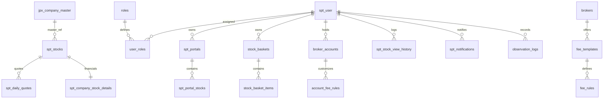

[Top](https://www.google.com/search?q=../../readme.md)

# データ設計（論理構成・詳細）

## 1.目次

- [データ設計（論理構成・詳細）](#データ設計論理構成詳細)
  - [1.目次](#1目次)
  - [2. 概要](#2-概要)
  - [3. 全体構成図 (ER図)](#3-全体構成図-er図)
  - [4. テーブル一覧（カテゴリ別）](#4-テーブル一覧カテゴリ別)
  - [4. テーブル一覧（カテゴリ別）](#4-テーブル一覧カテゴリ別-1)
  - [5. 各エンティティ詳細](#5-各エンティティ詳細)
    - [5.1 株価・銘柄マスタ](#51-株価銘柄マスタ)
      - [spt\_stocks](#spt_stocks)
      - [spt\_daily\_quotes](#spt_daily_quotes)
    - [5.2 ユーザー・権限](#52-ユーザー権限)
      - [spt\_user](#spt_user)
    - [5.3 バスケット](#53-バスケット)
      - [stock\_baskets（バスケット親）](#stock_basketsバスケット親)
      - [stock\_basket\_items（バスケット銘柄明細）](#stock_basket_itemsバスケット銘柄明細)
    - [5.4 証券口座・手数料シミュレーション](#54-証券口座手数料シミュレーション)
      - [brokers（証券会社マスタ）](#brokers証券会社マスタ)
      - [fee\_templates / fee\_rules](#fee_templates--fee_rules)
      - [broker\_accounts（ユーザーの証券口座）](#broker_accountsユーザーの証券口座)
      - [account\_fee\_rules（個別口座専用ルール）](#account_fee_rules個別口座専用ルール)
    - [5.5 ログ・通知](#55-ログ通知)
      - [spt\_stock\_view\_history（銘柄参照履歴）](#spt_stock_view_history銘柄参照履歴)
      - [spt\_notifications（通知）](#spt_notifications通知)
      - [observation\_logs（トレード観察ログ）](#observation_logsトレード観察ログ)
    - [6 口座取引・資産管理（追加セクション）](#6-口座取引資産管理追加セクション)
      - [6.1 account\_transactions](#61-account_transactions)

## 2. 概要

本システムは、Supabase (PostgreSQL) を基盤とした株価管理・ポートフォリオ構築システムです。
JPX銘柄マスタをベースとした株価データと、ユーザーごとの柔軟な証券口座・手数料シミュレーションを統合管理します。

---

## 3. 全体構成図 (ER図)

---

## 4. テーブル一覧（カテゴリ別）

ドキュメント内のリンクをGoogle検索ではなく、同一ファイル内のセクションへ飛ぶアンカーリンク（`#テーブル名`）に修正し、最新の構成に合わせて「テーブル一覧」を書き直しました。

## 4. テーブル一覧（カテゴリ別）

| カテゴリ | テーブル名 | 役割 |
| --- | --- | --- |
| **株価・銘柄** | [spt_stocks](#spt_stocks) | 銘柄の基本情報（コアテーブル） |
|  | [spt_daily_quotes](#spt_daily_quotes) | 日次株価の時系列データ |
|  | [spt_company_stock_details](#spt_company_stock_details) | 財務指標（PER, PBR等）の詳細 |
|  | [jpx_company_master](#jpx_company_master) | JPX提供の公式銘柄マスタ |
| **ユーザー・権限** | [spt_user](#spt_user) | ユーザー基本情報（Auth連携） |
|  | [roles](#roles) | 役割定義（管理者・一般等） |
|  | [user_roles](#user_roles) | ユーザーへのロール割り当て |
| **バスケット・ポータル** | [stock_baskets](#stock_baskets) | 簡易分類用バスケット（親） |
|  | [stock_basket_items](#stock_basket_items) | バスケット内銘柄リスト |
|  | [spt_portals](#spt_portals) | ポートフォリオ（詳細管理用・親） |
|  | [spt_portal_stocks](#spt_portal_stocks) | ポートフォリオ内銘柄・属性管理 |
| **口座・手数料** | [brokers](#brokers) | 証券会社マスタ |
|  | [fee_templates](#fee_templates) | 手数料プラン（コース）定義 |
|  | [fee_rules](#fee_rules) | プラン別の手数料計算ルール |
|  | [broker_accounts](#broker_accounts) | ユーザーの証券口座設定 |
|  | [account_fee_rules](#account_fee_rules) | 個別口座専用の手数料ルール |
| **ログ・通知** | [spt_stock_view_history](#spt_stock_view_history) | 銘柄参照履歴ログ |
|  | [spt_notifications](#spt_notifications) | 売買シグナル等の通知 |
|  | [observation_logs](#observation_logs) | 市場・トレード観察日記 |

---

## 5. 各エンティティ詳細

### 5.1 株価・銘柄マスタ

#### spt_stocks

個々の銘柄（企業）の基本情報。システム内の多くのテーブルがこの `code` を参照します。

| カラム名 | 型 | 補足 |
| --- | --- | --- |
| **code** | text | PK。銘柄コード（例: 7203） |
| name | text | 銘柄名/会社名 |
| market | text | 上場市場（東証プライム等） |
| industry | text | 業種 |
| tradable | boolean | 取引可能フラグ（デフォルト: TRUE） |
| created_at | timestamp | 作成日時 |

#### spt_daily_quotes

株価の日次推移データ。

| カラム名 | 型 | 補足 |
| --- | --- | --- |
| **code** | text | PK1。銘柄コード |
| **date** | date | PK2。日付 |
| open / high / low / close | numeric | 始値/高値/安値/終値 |
| volume | bigint | 出来高 |

*(以下、他テーブルの詳細も同様のH4形式で続きます)*

---

### 5.2 ユーザー・権限

#### spt_user

| カラム名 | 型 | 補足 |
| --- | --- | --- |
| **id** | UUID | PK。auth.users.id と連携 |
| email | TEXT | メールアドレス |
| name | TEXT | 表示名 |

---

### 5.3 バスケット

ユーザーが独自の銘柄リストを作成するための管理体系です。汎用的な「バスケット（カゴ）」を保持しています。

#### stock_baskets（バスケット親）

ユーザーが作成した銘柄グループの基本情報を管理します。

| カラム名 | 型 | NULL | 補足・役割 |
| --- | --- | --- | --- |
| **id** | bigint | NO | PK。自動採番。 |
| user_id | uuid | NO | FK。所有ユーザー（`auth.users` 参照）。 |
| name | text | NO | バスケットの名称。 |
| description | text | YES | バスケットの内容に関する説明・メモ。 |
| sort_order | integer | NO | 表示順序（デフォルト: 0）。 |
| created_at | timestamp | NO | 作成日時（UTC）。 |
| updated_at | timestamp | NO | 更新日時。トリガーにより自動更新。 |

#### stock_basket_items（バスケット銘柄明細）

各バスケットに含まれる銘柄のリストを管理する中間テーブルです。

| カラム名 | 型 | NULL | 補足・役割 |
| --- | --- | --- | --- |
| **id** | bigint | NO | PK。自動採番。 |
| stock_basket_id | bigint | NO | FK。`stock_baskets.id` を参照。親削除で連動削除。 |
| stock_code | text | NO | FK。`spt_stocks.code` を参照。 |
| sort_order | integer | NO | バスケット内での表示順序（デフォルト: 0）。 |
| added_at | timestamp | NO | 銘柄がバスケットに追加された日時。 |

---

### 5.4 証券口座・手数料シミュレーション

複雑な証券会社の手数料体系を正確に計算するためのモデルです。「標準マスタ」と「個別カスタマイズ」を両立させるハイブリッド設計になっています。

#### brokers（証券会社マスタ）

証券会社そのものを定義します。

| カラム名 | 型 | 補足 |
| --- | --- | --- |
| **id** | serial | 主キー |
| name | text | 略称（例：松井、野村） |
| formal_name | text | 正式名称 |
| is_active | boolean | 有効フラグ（論理削除用） |

#### fee_templates / fee_rules

証券会社が提供する「プラン」と、その「計算ルール」を定義します。

* **fee_templates**: 「一日定額コース」などの名称を保持。
* **fee_rules**: 「100万までは〇％」といった具体的な数値、`threshold_amount`（閾値）、`fee_rate`（率）、`is_daily_sum`（日次合算判定か）を保持します。

#### broker_accounts（ユーザーの証券口座）

ユーザーが実際に保有している口座を定義します。

| カラム名 | 型 | 補足 |
| --- | --- | --- |
| **id** | serial | 主キー |
| user_id | uuid | ユーザーID |
| broker_id | integer | 証券会社ID |
| template_id | integer | ベースとなっているプランID |
| name | text | 口座表示名（例：メイン口座） |
| is_nisa | boolean | NISA口座フラグ |
| **use_custom_fee** | boolean | カスタム手数料を使用するか（TRUEの場合、下記専用ルールを参照） |

#### account_fee_rules（個別口座専用ルール）

- ユーザーが独自に手数料を設定した場合、ここにそのルールのスナップショットを保存します。これにより、マスタ側のデータが更新されても、過去の計算結果やユーザーの設定に影響が出ないよう独立性を担保します。
---

### 5.5 ログ・通知

#### spt_stock_view_history（銘柄参照履歴）

「どの銘柄がよく見られているか」などの分析や、ユーザーの「最近見た銘柄」機能に使用します。

| カラム名 | 型 | 補足 |
| --- | --- | --- |
| **id** | bigserial | 主キー |
| user_id | uuid | 参照したユーザー |
| stock_code | text | 参照された銘柄コード |
| viewed_at | timestamptz | 参照日時 |

#### spt_notifications（通知）

売買シグナルやインフォメーションを格納します。

| カラム名 | 型 | 補足 |
| --- | --- | --- |
| **id** | uuid | 主キー |
| user_id | uuid | 通知対象ユーザー |
| type | text | 通知種別（'BUY_SIGNAL', 'INFO'など） |
| message | text | 内容 |
| is_read | boolean | 既読フラグ |

#### observation_logs（トレード観察ログ）

日々の市場の気づきをテキストやタグで記録します。

| カラム名 | 型 | 補足 |
| --- | --- | --- |
| **id** | serial | 主キー |
| date | date | 記録日 |
| content | text | 考察内容 |
| **stocks** | text[] | 関連する銘柄コードの配列 |
| tags | text[] | タグの配列 |

### 6 口座取引・資産管理（追加セクション）

株式売買も入出金も「資産の変動」であるという共通点に着目し、取引区分（`transaction_type`）によって入力項目を使い分ける設計です。

#### 6.1 account_transactions

ユーザーの口座における全ての資金・銘柄の変動履歴を記録します。

| カラム名 | 型 | NULL | 補足・役割 |
| --- | --- | --- | --- |
| **id** | bigint | NO | PK。自動採番。 |
| user_id | uuid | NO | FK。`spt_user.id` を参照。 |
| account_id | integer | NO | FK。`broker_accounts.id` を参照（対象口座）。 |
| stock_code | text | YES | FK。`spt_stocks.code` を参照。株式取引・配当の場合のみ。 |
| transaction_date | date | NO | 約定日または発生日。 |
| **transaction_type** | text | NO | 取引区分（後述）。 |
| quantity | numeric | YES | 数量（株数）。入出金時はNULL。 |
| unit_price | numeric | YES | 単価（円）。入出金時はNULL。 |
| fee | numeric | YES | 手数料。 |
| amount | numeric | NO | 収支合計額（受渡代金、入出金額）。 |
| tax | numeric | YES | 税金（配当金の源泉徴収など）。 |
| memo | text | YES | 備考欄。 |
| created_at | timestamp | NO | 登録日時。 |

単一テーブルで管理するため、このカラムの値でデータの性格を決定します。

* **株式関連**: `BUY`（現物買）、`SELL`（現物売）、`CREDIT_OPEN`（信用建）、`CREDIT_CLOSE`（信用埋）
* **資金関連**: `DEPOSIT`（入金）、`WITHDRAWAL`（出金）、`DIVIDEND`（配当金・分配金）、`INTEREST`（利息）、`OTHER`（その他）

- この設計の妥当性（メリット）

1. **残高計算の容易性**: `amount` を `SUM` するだけで、その口座の現在の現金残高が算出できます。
2. **時系列分析**: 「いつ、いくら資金が動いたか」を、売買と入出金を区別せずに一本のタイムラインで表示可能です。
3. **拡張性**: 将来的に「投資信託」や「貸株金」などの新しい取引種別が増えても、`transaction_type` を増やすだけで対応できます。

